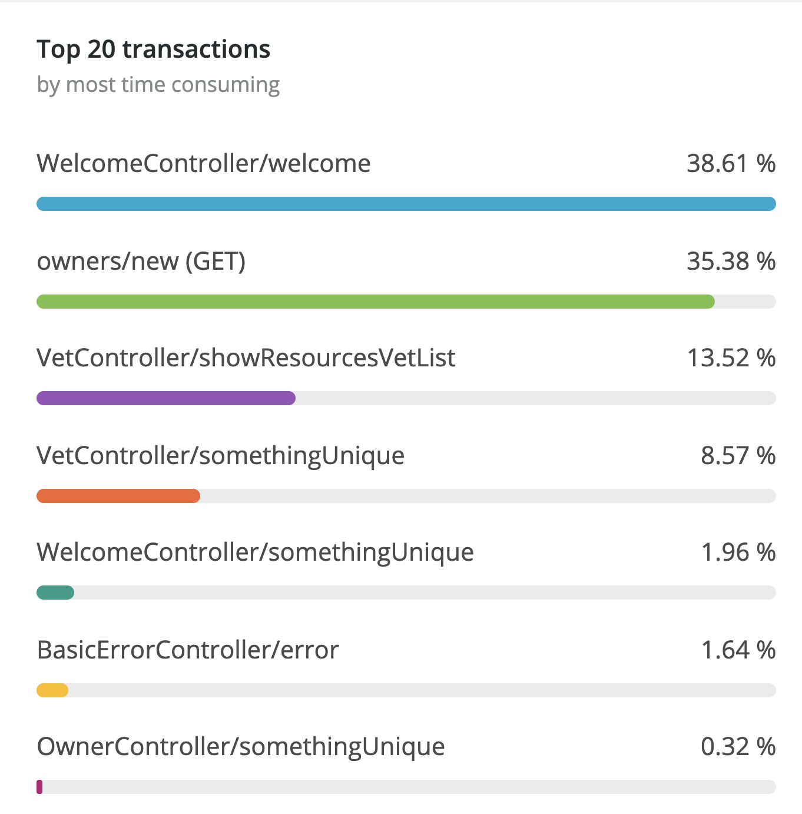

# Spring PetClinic Sample Application [](https://travis-ci.org/spring-projects/spring-petclinic/)

## Understanding the Spring Petclinic application with a few diagrams
<a href="https://speakerdeck.com/michaelisvy/spring-petclinic-sample-application">See the presentation here</a>

## Reproducing issue with transaction names in NR1

After starting app as defined below or in IDE with New Relic Agent attached, hit these endpoints

`GET http://localhost:8080/vets`
`GET http://localhost:8080/vets/list`
`GET http://localhost:8080/welcome`
`GET http://localhost:8080/welcome/html`
`GET http://localhost:8080/owners`
`GET http://localhost:8080/owners/new`



```
git clone https://github.com/spring-projects/spring-petclinic.git
cd spring-petclinic
./mvnw package
java -jar target/*.jar
```

Or you can run it from Maven directly using the Spring Boot Maven plugin. If you do this it will pick up changes that you make in the project immediately (changes to Java source files require a compile as well - most people use an IDE for this):

```
./mvnw spring-boot:run
```

> NOTE: Windows users should set `git config core.autocrlf true` to avoid format assertions failing the build (use `--global` to set that flag globally).

## In case you find a bug/suggested improvement for Spring Petclinic
Our issue tracker is available here: https://github.com/spring-projects/spring-petclinic/issues


